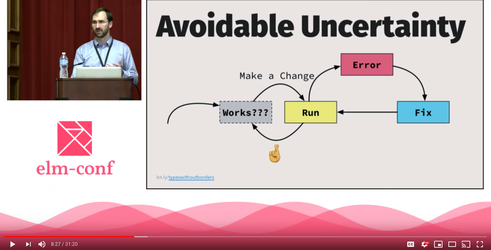
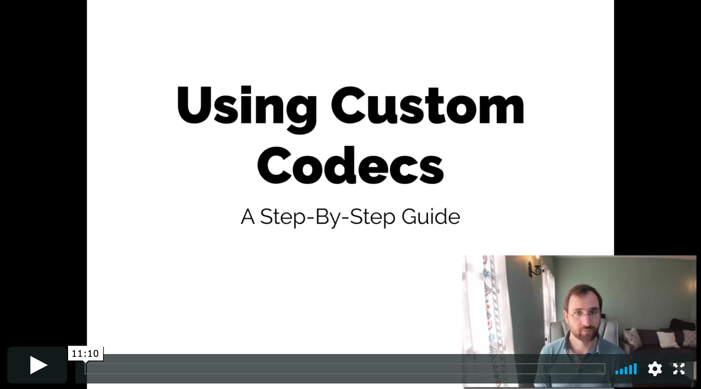

# dillonkearns/elm-graphql

[](https://github.com/dillonkearns/elm-graphql/actions?query=branch%3Amaster) [](https://package.elm-lang.org/packages/dillonkearns/elm-graphql/latest/)
[](https://npmjs.com/package/@dillonkearns/elm-graphql)


Why use this package over the other available Elm GraphQL packages? This is the only one that
generates type-safe code for your entire schema. Check out this blog post, [Type-Safe & Composable GraphQL in Elm](https://medium.com/open-graphql/type-safe-composable-graphql-in-elm-b3378cc8d021), to learn more about the motivation for this library. (It's also the only type-safe
library with Elm 0.18 or 0.19 support, see
[this discourse thread](https://discourse.elm-lang.org/t/introducing-graphqelm-a-tool-for-type-safe-graphql-queries/472/5?u=dillonkearns)).

I built this package because I wanted to have something that:

1. Gives you type-safe GraphQL queries (if it compiles, it's valid according to the schema),
2. Creates decoders for you in a seamless and failsafe way, and
3. Eliminates GraphQL features in favor of Elm language constructs where possible for a simpler UX (for example, GraphQL variables & fragments should just be Elm functions, constants, lets).

See an [example in action on Ellie](https://rebrand.ly/graphqelm). See more end-to-end example code in the
[`examples/`](https://github.com/dillonkearns/elm-graphql/tree/master/examples)
folder.

## Overview

`dillonkearns/elm-graphql` is an Elm package and accompanying command-line code generator that creates type-safe Elm code for your GraphQL endpoint. You don't write any decoders for your API with `dillonkearns/elm-graphql`, instead you simply select which fields you would like, similar to a standard GraphQL query but in Elm. For example, this GraphQL query

```graphql
query {
  human(id: "1001") {
    name
    homePlanet
  }
}
```

would look [like this](https://github.com/dillonkearns/elm-graphql/blob/master/examples/src/ExampleFromReadme.elm)
in `dillonkearns/elm-graphql` (the code in this example that is prefixed with `StarWars` is auto-generated)

```elm
import Graphql.Operation exposing (RootQuery)
import Graphql.SelectionSet as SelectionSet exposing (SelectionSet)
import StarWars.Object
import StarWars.Object.Human as Human
import StarWars.Query as Query
import StarWars.Scalar exposing (Id(..))


query : SelectionSet (Maybe HumanData) RootQuery
query =
    Query.human { id = Id "1001" } humanSelection


type alias HumanData =
    { name : String
    , homePlanet : Maybe String
    }


humanSelection : SelectionSet HumanData StarWars.Object.Human
humanSelection =
    SelectionSet.map2 HumanData
        Human.name
        Human.homePlanet
```

GraphQL and Elm are a perfect match because GraphQL is used to enforce the types that your API takes as inputs and outputs, much like Elm's type system does within Elm. `elm-graphql` simply bridges this gap by making your Elm code aware of your GraphQL server's schema. If you are new to GraphQL, [graphql.org/learn/](http://graphql.org/learn/) is an excellent way to learn the basics.

After following the installation instructions to install the [`@dillonkearns/elm-graphql`](https://npmjs.com/package/@dillonkearns/elm-graphql)
NPM package and the proper Elm packages (see the [Setup section](https://github.com/dillonkearns/elm-graphql#setup) for details).
Once you've installed everything, running the `elm-graphql` code generation tool
is as simple as this:

```bash
npx @dillonkearns/elm-graphql https://elm-graphql.onrender.com --base StarWars --output examples/src
```

If headers are required, such as a Bearer Token, the `--header` flag can be supplied.

```bash
npx @dillonkearns/elm-graphql https://elm-graphql.onrender.com --base StarWars --output examples/src --header 'headerKey: header value'
```

## Learning Resources

- There is a thorough tutorial in [the `SelectionSet` docs](https://package.elm-lang.org/packages/dillonkearns/elm-graphql/latest/Graphql-SelectionSet). `SelectionSet`s are the core concept in this library, so I recommend reading through the whole page (it's not very long!).

- The [`examples/`](https://github.com/dillonkearns/elm-graphql/tree/master/examples) folder is another great place to start.

- If you want to learn more GraphQL basics, this is a great tutorial, and a short read: [graphql.org/learn/](http://graphql.org/learn/)

- My Elm Conf 2018 talk goes into the philosophy behind `dillonkearns/elm-graphql`

[](https://www.youtube.com/watch?v=memIRXFSNkU)

([Skip to 13:06](https://youtu.be/memIRXFSNkU?t=786) to go straight to the `dillonkearns/elm-graphql` demo).

- My 10-minute video tutorial on how to leverage Custom Scalars in `elm-graphql` using the Scalar Codecs feature.
  [](https://incrementalelm.com/scalar-codecs-tutorial)

* [A Beginner's Guide to GraphQL with Elm](https://medium.com/@zenitram.oiram/a-beginners-guide-to-graphql-with-elm-315b580f0aad) by [@martimatix](https://github.com/martimatix)
* [The Beginners Guide to elm-graphql by Samuel Wood](https://medium.com/@samote.wood/an-intro-to-elm-graphql-cac214cc048)
* [Graphqelm: Optional Arguments in a Language Without Optional Arguments](https://medium.com/@zenitram.oiram/graphqelm-optional-arguments-in-a-language-without-optional-arguments-d8074ca3cf74) by [@martimatix](https://github.com/martimatix)
* [Comprehensive tutorial by the Hasura Team](https://learn.hasura.io/graphql/elm-graphql/introduction)

If you're wondering why code is generated a certain way, you're likely to find an answer in the [Frequently Asked Questions (FAQ)](https://github.com/dillonkearns/elm-graphql/blob/master/FAQ.md).

There's a very helpful group of people in the #graphql channel in [the Elm Slack](http://elmlang.herokuapp.com/). Don't hesitate to ask any questions about getting started, best practices, or just general GraphQL in there!

## Setup

`dillonkearns/elm-graphql` generates Elm code that allows you to build up type-safe GraphQL requests. Here are the steps to setup `dillonkearns/elm-graphql`.

1. Add [the `dillonkearns/elm-graphql` elm package](http://package.elm-lang.org/packages/dillonkearns/elm-graphql/latest)
   as a dependency in your `elm.json`. You will also need to make sure that `elm/json` is a dependency of your project
   since the generated code has lots of JSON decoders in it.
   ```shell
   elm install dillonkearns/elm-graphql
   elm install elm/json
   ```
2. Install the `@dillonkearns/elm-graphql` command line tool through npm. This is what you will use to generate Elm code for your API.
   It is recommended that you save the `@dillonkearns/elm-graphql` command line tool as a dev
   dependency so that everyone on your project is using the same version.

   ```shell
   npm install --save-dev @dillonkearns/elm-graphql
   # you can now run it locally using `npx elm-graphql`,
   # or by calling it through an npm script as in this project's package.json
   ```

3. Run the `@dillonkearns/elm-graphql` command line tool installed above to generate your code. If you used the `--save-dev` method above, you can simply create a script in your package.json like the following:

   ```
   {
     "name": "star-wars-elm-graphql-project",
     "version": "1.0.0",
     "scripts": {
       "api": "elm-graphql https://elm-graphql.onrender.com/api --base StarWars"
     }
   ```

4. With the above in your `package.json`, running `npm run api` will generate `dillonkearns/elm-graphql` code for you to call in `./src/StarWars/`. You can now use the generated code as in this [Ellie example](https://rebrand.ly/graphqelm) or in the [`examples`](https://github.com/dillonkearns/elm-graphql/tree/master/examples) folder.

## Subscriptions Support

You can do real-time APIs using GraphQL Subscriptions and `dillonkearns/elm-graphql`.
Just wire in the framework-specific JavaScript code for opening the WebSocket connection
through a port. Here's a [live demo](https://dillonkearns.github.io/elm-graphql/) and its
[source code](https://github.com/dillonkearns/elm-graphql/tree/master/examples/subscription). The [demo server is running Elixir/Absinthe](https://github.com/dillonkearns/graphqelm-demo).

## Contributors

Thank you Mario Martinez ([martimatix](https://github.com/martimatix)) for
all your feedback, the elm-format PR, and for [the incredible logo design](https://github.com/martimatix/logo-graphqelm/)!

Thank you Mike Stock ([mikeastock](https://github.com/mikeastock/)) for
setting up Travis CI!

Thanks for [the reserved words pull request](https://github.com/dillonkearns/elm-graphql/pull/41) @madsflensted!

A huge thanks to [@xtian](https://github.com/xtian) for doing the vast majority
of the [0.19 upgrade work](https://github.com/dillonkearns/elm-graphql/pull/60)! :tada:

Thank you [Josh Adams (@knewter)](https://github.com/knewter) for the code example for
Subscriptions with Elixir/Absinthe wired up through Elm ports!

Thank you [Romario](https://github.com/romariolopezc) for adding [`OptionalArgument.map`](https://github.com/dillonkearns/elm-graphql/pull/73)!

Thank you [Aaron White](https://github.com/aaronwhite) for [your pull request to improve the performance and
stability of the `elm-format` step](https://github.com/dillonkearns/elm-graphql/pull/87)! 🎉

## Roadmap

All core features are supported. That is, you can build any query or mutation
with your `dillonkearns/elm-graphql`-generated code, and it is guaranteed to be valid according
to your server's schema.

`dillonkearns/elm-graphql` will generate code for you to generate subscriptions
and decode the responses, but it doesn't deal with the low-level details for
how to send them over web sockets. To do that, you will need to use
custom code or a package that knows how to communicate over websockets (or whichever
protocol) to setup a subscription with your particular framework. See
[this discussion](https://github.com/dillonkearns/elm-graphql/issues/43) for why
those details are not handled by this library directly.

I would love to hear feedback if you are using GraphQL Subscriptions. In particular,
I'd love to see live code examples to drive any improvements to the Subscriptions
design. Please ping me on Slack, drop a message in the
[#graphql](https://elmlang.slack.com/channels/graphql) channel, or open up a
Github issue to discuss!

I would like to investigate generating helpers to make pagination simpler
for Connections (based on the
[Relay Cursor Connections Specification](https://relay.dev/graphql/connections.htm)).
If you have ideas on this chime in on [this thread](https://github.com/dillonkearns/elm-graphql/issues/29).

See [the full roadmap on Trello](https://trello.com/b/BCIWtZeL/dillonkearns-elm-graphql).
