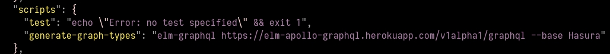
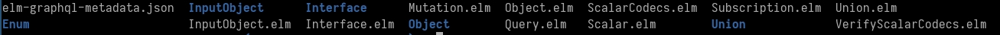
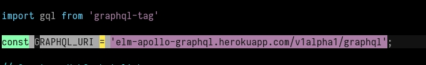
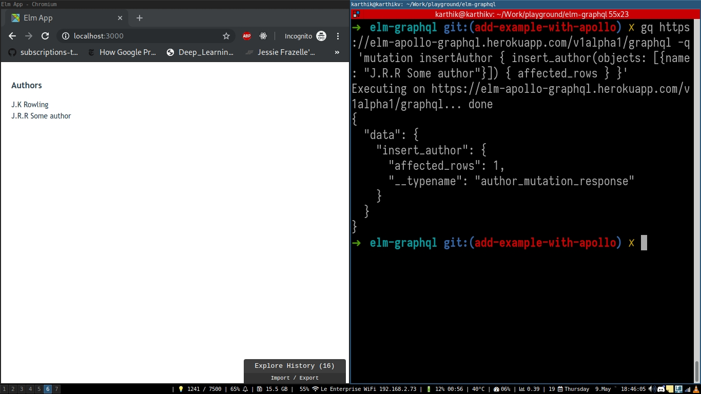

# subscription-apollo

Example usage of GraphQL subscriptions using Elm-GraphQL and [Apollo Client](https://github.com/apollographql/apollo-client).

# Tutorial

- Clone this repo:
  ```bash
  git clone https://github.com/dillonkearns/elm-graphql
  cd examples/src/subscription-apollo
  ```

- Install npm modules:
  ```bash
  npm install
  ```

- Generate elm types for your GraphQL schema.
  
  ```bash
  npm run generate-graph-types
  ```

  `generate-graph-types` is an npm script which generates a GraphQL schema for the configured GraphQL server.

  

  The above command should generate following files

  

- Configure apollo client with the GraphQL server url

  

- Create a GraphQL query from your elm code

```elm

--- Create a GraphQL subscription object using the objects generated by `graphql-elm`

subscriptionDocument : SelectionSet Authors RootSubscription
subscriptionDocument =
    Subscription.author identity authorSelection


-- Select information based on the requirement in the UI.
authorSelection : SelectionSet Author Hasura.Object.Author
authorSelection =
    SelectionSet.map2 Author
        Author.id
        Author.name
```

- Run the app

  ```bash
  elm-app start
  ```
- Test the app

  Visit [http://localhost:3000](http://localhost:3000) to view the app

  
  
  Lets add more data and see if the data is reflecting in the UI

  Install graphqurl to simulate sample mutations

  ```bash
  npm install -g graphqurl
  ```

  Lets run the following query

  ```
  mutation insertAuthor {
    insert_author(objects: [{name: "J.R.R Tolkien"}]) {
      affected_rows
    }
  }
  ```

  ```bash
  gq https://elm-apollo-graphql.herokuapp.com/v1alpha1/graphql -q 'mutation insertAuthor { insert_author(objects: [{name: "J.R.R Some author"}]) { affected_rows } }'
  ```

  

Demo Application:
  This example is tested with Hasura GraphQL Engine and a demo is currently deployed on netlify
  App URL: 

  GraphQL URL: https://elm-apollo-graphql.herokuapp.com/console/api-explorer
