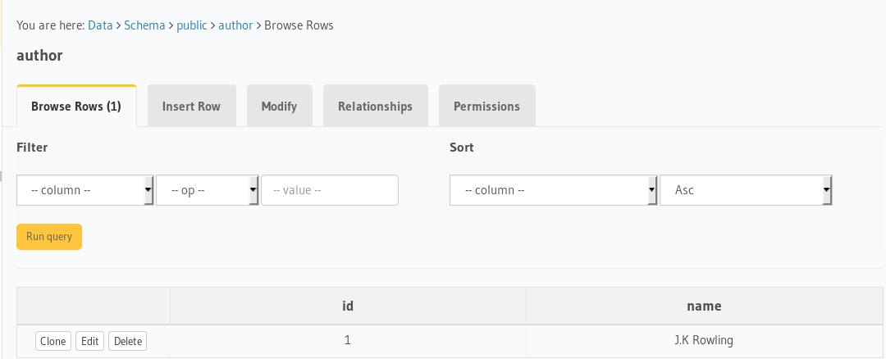
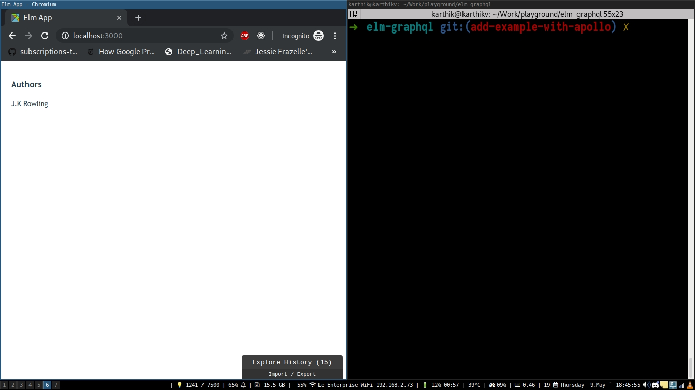

# elm-apollo-subscription

Boilerplate to get started with Elm, Hasura GraphQL engine as CMS and postgres as database

# Tutorial

- Deploy Postgres and GraphQL Engine on Heroku:
  [](https://heroku.com/deploy?template=https://github.com/hasura/graphql-engine-heroku)
- Get the Heroku app URL (say `my-app.herokuapp.com`)
- Clone this repo:
  ```bash
  git clone https://github.com/dillonkearns/elm-graphql
  cd examples/src/subscription
  ```

- Create `author` table:
  
  Open Hasura console: visit https://my-app.herokuapp.com on a browser  
  Navigate to `Data` section in the top nav bar and create a table as follows:

  

- Insert sample data into `author` table:

  

  Verify if the row is inserted successfully

  

- Install npm modules:
  ```bash
  npm install
  ```

- Generate elm types for your GraphQL schema

  ```bash
  npm run generate-graph-types
  ```

  The above command should generate following files

  

- Next lets configure our apollo client with the GraphQL server url

  

- Create a GraphQL query from your elm code

```elm

--- Create a GraphQL subscription object using the objects generated by `graphql-elm`

subscriptionDocument : SelectionSet Authors RootSubscription
subscriptionDocument =
    Subscription.author identity authorSelection


-- Select information based on the requirement in the UI.
authorSelection : SelectionSet Author Hasura.Object.Author
authorSelection =
    SelectionSet.map2 Author
        Author.id
        Author.name
```

- Run the app:

  ```bash
  elm-app start
  ```
- Test the app
  Visit [http://localhost:3000](http://localhost:3000) to view the app

  
  
  Lets add more data and see if the data is reflecting in the UI

  Install graphqurl to simulate sample mutations

  ```bash
  npm install -g graphqurl
  ```

  Lets run the following query

  ```
  mutation insertAuthor {
    insert_author(objects: [{name: "J.R.R Tolkien"}]) {
      affected_rows
    }
  }
  ```

  ```bash
  gq https://elm-apollo-graphql.herokuapp.com/v1alpha1/graphql -q 'mutation insertAuthor { insert_author(objects: [{name: "J.R.R Some author"}]) { affected_rows } }'
  ```

  


  
